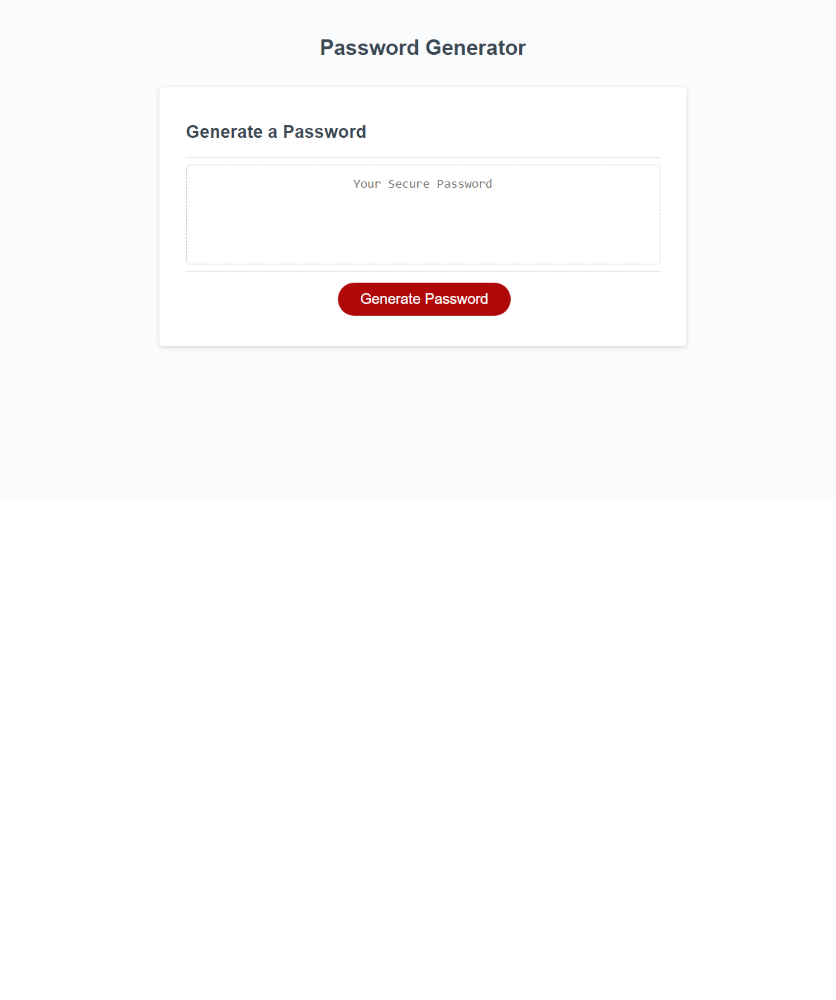

# Assignment3JavaScript
03 JavaScript: Password Generator

## Your Task

This app will run in the browser and will feature dynamically updated HTML and CSS powered by JavaScript code that you write.

## User Story

This website has been to access sensitive data and would like to ensure high level of security. They would like to ensure high level security. When we click the generate butoon then randomly create a password. 


## Acceptance Criteria

```
GIVEN I need a new, secure password
WHEN I click the button to generate a password
THEN I am presented with a series of prompts for password criteria
WHEN prompted for password criteria
THEN I select which criteria to include in the password
WHEN prompted for the length of the password
THEN I choose a length of at least 8 characters and no more than 128 characters
WHEN asked for character types to include in the password
THEN I confirm whether or not to include lowercase, uppercase, numeric, and/or special characters
WHEN I answer each prompt
THEN my input should be validated and at least one character type should be selected
WHEN all prompts are answered
THEN a password is generated that matches the selected criteria
WHEN the password is generated
THEN the password is either displayed in an alert or written to the page
```

> **Note**: There is starter code for this assignment.

​screenshot for generate HTML webpages :


​

​
## GitHub Repo
​
[junghan84](https://github.com/junghan84/Generate_Password2)
​
## Video Walkthrough

## Features
*HTML
*CSS
*JavaScript
​
## Project Description

This code was made in JavaScript to create ramdom password with number, specail character, lowercase and uppercase. 
​
## Installation
1.Clone repository
2.Read README file and follow the installation step.
3.Using JavaScript created code.
​
## Usage
​
To search google books and save favorites to your account.
​
## Test Instructions
​
​![Test HTML Webpage video]https://drive.google.com/file/d/1P1K4a5O1LGAHdxzgZbh-8DdPFQGA-B2q/view
​

​
## Preview Image

​

​
## Contact me with questions
​
junghanseo84@gmail.com

Below is the link to the reafctored website :
Website URL: https://junghan84.github.io/Generate_Password2/

Repository URL: 
https://github.com/junghan84/Generate_Password2